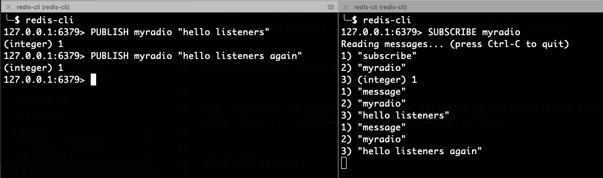

In this post, we will be creating a simple scalable dashboard that updates in real-time using [React](ll), [GraphQL Subscriptions](ll) and [Redis PubSub](ll). Real-time dashboards can be used to monitor your **infrastructure** (servers, network, services), **application traffic** (transaction volume, number of users), **alerts** (application health, critical issues, downtimes) etc. Almost always, dashboards are backed up with one or more datasources.

There are many open-source applications that can be used to create dashboards. For example, **[Kibana](ll)** can be used to visualize application logs integrated with [ELK Stack](ll). **[Grafana](ll)** can be used to create a variety of visualizations on top of time series databases such as [Prometheus](ll), [Graphite](ll) and [OpenTSDB](ll). But, as of today, they support [pull-based model](https://en.wikipedia.org/wiki/Pull_technology). That is, when a user opens the browser, application makes the queries and result is rendered. It is the most widely used model as opposed to a [Push model](https://en.wikipedia.org/wiki/Push_technology). 

## When push-model can be used?

Assume you have a dashboard containing ***20 panels***, querying data from multiple datasources at the backend in real-time. User has set a refresh rate of ***5 seconds***. If, on an average ***100 users*** open the dashboard at any time - that is ***20 x 100 = 2000 requests*** every 5 seconds! This is manageable if you have good infrastructure for your underlying time-series database. Multiple Heavy queries can pile-up the memory. This problem can be solved either by introducing some intelligent caching, or a simple push-model using [WebSockets](ll). It is useful (and simple), for the situation where multiple users are querying for the same data, at same or slightly-different time. 

* Connection is established between server and client using WebSocket.
* Server sends the required data to Client at regular intervals
* If the connection breaks, client can retry indefinitely.

### What are we building?

Here's the preview of a simple real-time dashboard we will be building. It contains 4 panels - CPU Utilization, Traffic information, Data-center distribution and alerts.


## GraphQL Subscriptions

[GraphQL](ll) is a query language for APIs and a runtime for fulfilling those queries with your existing data. Check out [graphql.org](https://graphql.org/) for more info if you are not familiar with GraphQL.

Along with [queries](ll) and [mutations](ll), GraphQL introduced one more specification - [Subscriptions](ll). 

>  just as the list of mutations that the server supports describes all of the actions that a client can take, the list of subscriptions that the server supports describes all of the events that it can subscribe to. Just as a client can tell the server what data to refetch after it performs a mutation with a GraphQL selection, the client can tell the server what data it wants to be pushed with the subscription with a GraphQL selection. - [GraphQL blog](https://graphql.org/blog/subscriptions-in-graphql-and-relay/)

For example, client can subscribe for CPU data using the following subscription syntax

```graphql
subscription CPU {
  cpu {
    percentage
  }
}
```

Server can publish the data at regular intervals,

```js
pubsub.publish(CPU, { cpu: { percentage: 65 } });
```

## Redis PubSub

Since version 2.0, Redis supports [Publish-Subscribe pattern](http://en.wikipedia.org/wiki/Publish/subscribe) using commands [PUBLISH](https://redis.io/commands/publish), [SUBSCRIBE](https://redis.io/commands/subscribe) and [UNSUBSCRIBE](https://redis.io/commands/unsubscribe). Read more about it from [Redis Documentation](https://redis.io/topics/pubsub).

Message can be published via **channels**. If we want to send message `"hello listeners"` via channel `myradio`, simply use the `PUBLISH` command

```bash
PUBLISH myradio "hello listeners"
```

But, a channel is useless if nobody is listening on the other side! Open another tab with `redis-cli` and subscribe to the channel `myradio`.

```bash
SUBSCRIBE myradio
```

Now, send the publish command again and watch for the same in the other terminal



### Combining GraphQL subscription & Redis PubSub

We can implement GraphQL subscription specification using [Apollo](https://www.apollographql.com/)'s package - [graphql-subscriptions](https://github.com/apollographql/graphql-subscriptions). 

Using Redis as mediator for publishing events from client to server enables us horizontally scale. We can plug in [graphql-redis-subscriptions](https://github.com/davidyaha/graphql-redis-subscriptions) as PubSubEngine interface to `graphql-subscriptions`.

## Sample Implementation

For full implementation - see [github.com/nowke/realtime-dashboard-demo/](https://github.com/nowke/realtime-dashboard-demo/). We will look at the important parts here.

We're going to build 3 components

* Server
* Client - user's browser, connects to server
* Worker - mocks real events by publishing events to server

### Server

Install the required pacakges

```
yarn add graphql apollo-server graphql-redis-subscriptions graphql-subscriptions ioredis moment
```

If you have `redis-server` running in local at `PORT 6379`, setup the PubSub using `graphql-redis-subscriptions`. We will use it to publish messages

**[`server/pubsub.js`](https://github.com/nowke/realtime-dashboard-demo/blob/master/server/pubsub.js)**
```js
const { RedisPubSub } = require("graphql-redis-subscriptions");

const pubsub = new RedisPubSub();
module.exports = pubsub;
```

Define the GraphQL schema. We use,

* **Query** - for getting initial result from Redis
* **Mutation** - to publish new messages
* **Subscription** - websocket connection between client and server for real-time updating the graphs

```graphql
const { gql } = require("apollo-server");

const schema = gql`
  type Dps {
    timestamp: Int!
    value: Float!
  }

  type Traffic {
    total: Int!
    dps: [Dps]
  }

  type CPU {
    percentage: Float!
  }

  type Distribution {
    region: String!
    percentage: Float!
  }

  type Message {
    title: String!
    description: String!
    color: String!
  }

  type Query {
    cpu: CPU
    traffic: Traffic
    distribution: [Distribution]
    messages: [Message]
  }

  type Mutation {
    cpu: CPU
    traffic: Traffic
    distribution: [Distribution]
    messages: [Message]
  }

  type Subscription {
    cpu: CPU
    traffic: Traffic
    distribution: [Distribution]
    messages: [Message]
  }
`;

module.exports = schema;
```

I have provided helper functions to generate dummy data for each 4 panels. Refer [`server/utils/generator.js`](https://github.com/nowke/realtime-dashboard-demo/blob/master/server/utils/generator.js). Using these functions, let's write a function `publishRandomData`.

```js
const pubsub = require("./pubsub");
const { set } = require("./utils/redis");

const COMPONENTS = {
  CPU: "cpu",
  TRAFFIC: "traffic",
  DISTRIBUTION: "distribution",
  MESSAGES: "messages"
};

const publishRandomData = async (generator, component) => {
  const data = generator();
  pubsub.publish(component, { [component]: data });
  await set(component, data);
  return data;
};
```

We can call this function for CPU usage as below

```js
const getCPU = () => 50;
await publishRandomData(getCPU, "CPU")
```

Define the resolver functions for the schema we wrote earlier (sample for CPU)

**[`server/resolvers.js`](https://github.com/nowke/realtime-dashboard-demo/blob/master/server/resolvers.js)**
```js
const { get } = require("./utils/redis");

module.exports = {
  Query: {
    cpu: () => get(COMPONENTS.CPU)
  },
  Mutation: {
    cpu: () => publishRandomData(cpuData, COMPONENTS.CPU),
  },
  Subscription: {
    cpu: {
      subscribe: () => pubsub.asyncIterator(COMPONENTS.CPU)
    },
  }
}
```

Start the server

**[`server/index.js`](https://github.com/nowke/realtime-dashboard-demo/blob/master/server/index.js)**
```js
const { ApolloServer } = require("apollo-server");

const typeDefs = require("./schema");
const resolvers = require("./resolvers");

// Server
const server = new ApolloServer({ typeDefs, resolvers });

server.listen().then(({ url }) => {
  console.log(`🚀  Server ready at ${url}`);
});
```

```
$ yarn start
yarn run v1.13.0
$ nodemon index.js
...
🚀  Server ready at http://localhost:4000/
```

Go to [localhost:4000](http://localhost:4000/) to open GraphQL playground.

Subscribe to CPU percentage in **Tab 1** and hit the play button

```graphql
subscription {
  cpu {
    percentage
  }
}
```

Run the mutation for CPU in **Tab 2**, to publish random percentage value. You should receive the value as an event in **Tab 1**. Try the mutation multiple times to receive different values.

```graphql
mutation {
  cpu {
    percentage
  }
}
```

Run the query for CPU in **Tab 3**. You should see the last published value - this is because we have cached the recent value in Redis

```graphql
query {
  cpu {
    percentage
  }
}
```

```json
{
  "data": {
    "cpu": {
      "percentage": 25
    }
  }
}
```

### Client

Create a new React application using `create-react-app` for client

```sh
yarn create react-app client
```

Install the required dependencies.

```sh
yarn add apollo-boost apollo-client apollo-link-ws graphql react-apollo subscriptions-transport-ws
```

Setup Apollo HTTP client and websocket client, since we need both type of connection to the server. HTTP server will be running at `http://localhost:4000` and websocket subscription server at `ws://localhost:4000/graphql`.

**[`client/src/App.js`](https://github.com/nowke/realtime-dashboard-demo/blob/master/client/src/App.js)**

```jsx
import React, { Component } from "react";
import { ApolloClient } from "apollo-client";
import { InMemoryCache } from "apollo-cache-inmemory";
import { ApolloProvider } from "react-apollo";
import { split } from "apollo-link";
import { HttpLink } from "apollo-link-http";
import { WebSocketLink } from "apollo-link-ws";
import { getMainDefinition } from "apollo-utilities";

import './App.css'
import Home from "./Pages/Home";

// Create an http link:
const httpLink = new HttpLink({
  uri: "http://localhost:4000"
});

// Create a WebSocket link:
const wsLink = new WebSocketLink({
  uri: `ws://localhost:4000/graphql`,
  options: {
    reconnect: true
  }
});

// using the ability to split links, you can send data to each link
// depending on what kind of operation is being sent
const link = split(
  // split based on operation type
  ({ query }) => {
    const { kind, operation } = getMainDefinition(query);
    return kind === "OperationDefinition" && operation === "subscription";
  },
  wsLink,
  httpLink
);

const client = new ApolloClient({
  link,
  cache: new InMemoryCache()
});

class App extends Component {
  render() {
    return (
      <ApolloProvider client={client}>
        <Home />
      </ApolloProvider>
    );
  }
}

export default App;
```

We have wrapped our `Home` component with `ApolloProvider`, which enables us to run queries and subscriptions.

Let us design CPU usage component - [CpuUsage.js](https://github.com/nowke/realtime-dashboard-demo/blob/master/client/src/components/CpuUsage.js).

Define the query and subscription

```js
import gql from "graphql-tag";

const QUERY = gql`
  query CPU {
    cpu {
      percentage
    }
  }
`;

const SUBSCRIPTION = gql`
  subscription CPU {
    cpu {
      percentage
    }
  }
`;
```

Our requirement is as follows.

* On initial load, data should be rendered via `query`
* Post load, component should render the value from subscription

This can be achieved using `subscribeToMore` prop given by `Query` component in `react-apollo` - [https://www.apollographql.com/docs/react/advanced/subscriptions.html#subscribe-to-more](https://www.apollographql.com/docs/react/advanced/subscriptions.html#subscribe-to-more)

```jsx
import React, { Component } from "react";
import { Query } from "react-apollo";

const CpuUsageContainer = () => (
  <Query query={QUERY}>
    {({ subscribeToMore, ...result }) => (
      <CpuUsage
        {...result}
        subscribeToNewData={() =>
          subscribeToMore({
            document: SUBSCRIPTION,
            updateQuery: (prev, { subscriptionData }) => {
              if (!subscriptionData.data) return prev;
              return subscriptionData.data;
            }
          })
        }
      />
    )}
  </Query>
)
```

Display CPU percentage inside `CpuUsage` component.

```jsx
class CpuUsage extends Component {
  componentDidMount() {
    this.props.subscribeToNewData();
  }

  render() {
    const { data, error, loading } = this.props;
    if (loading) return <p> Loading ... </p>;
    if (error) return <p>Error!</p>;
    return (
      <p> CPU Usage: {data.cpu.percentage}% </p>
    )
  }
}
```

Refer the file [CpuUsage.js](https://github.com/nowke/realtime-dashboard-demo/blob/master/client/src/components/CpuUsage.js) for complete class definition with Pie chart


### Worker

Let us write a small script that mocks real events by calling mutation for 4 panels at regular intervals. We will use [node-schedule](https://www.npmjs.com/package/node-schedule) package.

Install the dependencies

```
yarn add node-schedule request request-promise
```

Define the mutations for each panels

```js
const queries = {
  CPU: `
    mutation {
      cpu {
        percentage
      }
    }
    `,
  TRAFFIC: `
    mutation {
      traffic {
        total
        dps {
          timestamp
          value
        }
      }
    }
    `,
  DISTRIBUTION: `
    mutation {
      distribution {
        region
        percentage
      }
    }
    `,
  MESSAGES: `
    mutation {
      messages {
        title
        description
        color
      }
    }
    `
};
```

For example, add a scheduler for CPU using `schedule.scheduleJob` for every 3 seconds

```js
const schedule = require("node-schedule");

schedule.scheduleJob("*/3 * * * * *", async () => {
  await makeHttpRequest("CPU"); // Call mutation for CPU panel
  console.log("Fetched new results for CPU");
});
```

Refer [worker/worker.js](https://github.com/nowke/realtime-dashboard-demo/blob/master/worker/worker.js) for complete script

Run the worker

```
$ yarn start
yarn run v1.13.0
$ node worker.js
Starting worker
Scheduled Jobs for CPU, Traffic, distribution, messages
Fetched new results for TRAFFIC
Fetched new results for MESSAGES
Fetched new results for CPU
Fetched new results for DISTRIBUTION
Fetched new results for CPU
Fetched new results for MESSAGES
Fetched new results for TRAFFIC
...
...
```


## Scaling

For high-availability, server will be deployed in multiple instances connected using Load-balancer. 

Consider 4 servers `server1`, `server2`, `server3` and `server4`. When a user opens the browser (client), it can connect to any of the servers via load-balancer. All of these servers are connected to a redis cluster `redis-cluster`

If nginx is used, routing websocket requests is possible by changing the configuration. Refer [www.nginx.com/blog/websocket-nginx/](https://www.nginx.com/blog/websocket-nginx/) for details.

### Architecture diagram

The following diagram represents where 4 clients are connected to 4 servers via load-balancer


Analyzing a request flow from **Worker**,


1. Worker makes a **`POST`** request (a **mutation**) to one of the servers (via **load balancer**), say `server1`
2. **`server1`** sends **`PUBLISH`** command to redis cluster with data for `cpu`
3. Since all servers are subscribed to same channel in redis, all of them receive data for `cpu`
4. Servers publish the data via websocket to all the clients.