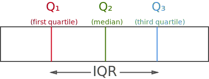
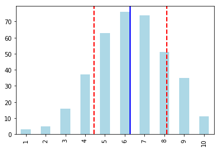
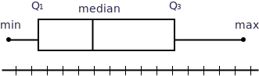
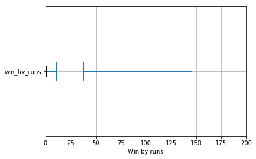
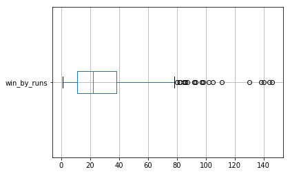

Originally published in [Kaggle](https://www.kaggle.com/nowke9/statistics-1-summarizing-quantitative-data)

# Introduction
**Quantitative data** is information that can be measured in real numbers. Examples include,
* Height of a person
* Speed of Tesla cars
* Runs scored by a batsman
* Wickets taken by a bowler

In this notebook, we'll explore various statistical concepts involved in **summarizing quantitative data** with the help of **Indian Premier League (IPL)** dataset.

The data consists of two CSV files for all IPL matches played from  **2008 - 2018** (11 seasons)
* **`matches.csv`** - match-by-match data
* **`deliveries.csv`** - ball-by-ball data

Let's setup `pandas` dataframes for the above files and import necessary libraries.


```python
import math
import numpy as np
import pandas as pd
from scipy import stats
import os

matches    = pd.read_csv('../input/matches.csv')
deliveries = pd.read_csv('../input/deliveries.csv')
```

Let's inspect the `matches` data before stepping into the concepts


```python
print(f'Number of rows    = {len(matches)}')
print(f'Number of columns = {len(matches.columns)}')
matches.head()
```

    Number of rows    = 696
    Number of columns = 18


<div>
<style scoped>
    .dataframe tbody tr th:only-of-type {
        vertical-align: middle;
    }

    .dataframe tbody tr th {
        vertical-align: top;
    }

    .dataframe thead th {
        text-align: right;
    }
</style>
<table border="1" class="dataframe">
  <thead>
    <tr style="text-align: right;">
      <th></th>
      <th>id</th>
      <th>season</th>
      <th>city</th>
      <th>date</th>
      <th>team1</th>
      <th>team2</th>
      <th>toss_winner</th>
      <th>toss_decision</th>
      <th>result</th>
      <th>dl_applied</th>
      <th>winner</th>
      <th>win_by_runs</th>
      <th>win_by_wickets</th>
      <th>player_of_match</th>
      <th>venue</th>
      <th>umpire1</th>
      <th>umpire2</th>
      <th>umpire3</th>
    </tr>
  </thead>
  <tbody>
    <tr>
      <th>0</th>
      <td>1</td>
      <td>2017</td>
      <td>Hyderabad</td>
      <td>2017-04-05</td>
      <td>Sunrisers Hyderabad</td>
      <td>Royal Challengers Bangalore</td>
      <td>Royal Challengers Bangalore</td>
      <td>field</td>
      <td>normal</td>
      <td>0</td>
      <td>Sunrisers Hyderabad</td>
      <td>35</td>
      <td>0</td>
      <td>Yuvraj Singh</td>
      <td>Rajiv Gandhi International Stadium, Uppal</td>
      <td>AY Dandekar</td>
      <td>NJ Llong</td>
      <td>NaN</td>
    </tr>
    <tr>
      <th>1</th>
      <td>2</td>
      <td>2017</td>
      <td>Pune</td>
      <td>2017-04-06</td>
      <td>Mumbai Indians</td>
      <td>Rising Pune Supergiant</td>
      <td>Rising Pune Supergiant</td>
      <td>field</td>
      <td>normal</td>
      <td>0</td>
      <td>Rising Pune Supergiant</td>
      <td>0</td>
      <td>7</td>
      <td>SPD Smith</td>
      <td>Maharashtra Cricket Association Stadium</td>
      <td>A Nand Kishore</td>
      <td>S Ravi</td>
      <td>NaN</td>
    </tr>
    <tr>
      <th>2</th>
      <td>3</td>
      <td>2017</td>
      <td>Rajkot</td>
      <td>2017-04-07</td>
      <td>Gujarat Lions</td>
      <td>Kolkata Knight Riders</td>
      <td>Kolkata Knight Riders</td>
      <td>field</td>
      <td>normal</td>
      <td>0</td>
      <td>Kolkata Knight Riders</td>
      <td>0</td>
      <td>10</td>
      <td>CA Lynn</td>
      <td>Saurashtra Cricket Association Stadium</td>
      <td>Nitin Menon</td>
      <td>CK Nandan</td>
      <td>NaN</td>
    </tr>
    <tr>
      <th>3</th>
      <td>4</td>
      <td>2017</td>
      <td>Indore</td>
      <td>2017-04-08</td>
      <td>Rising Pune Supergiant</td>
      <td>Kings XI Punjab</td>
      <td>Kings XI Punjab</td>
      <td>field</td>
      <td>normal</td>
      <td>0</td>
      <td>Kings XI Punjab</td>
      <td>0</td>
      <td>6</td>
      <td>GJ Maxwell</td>
      <td>Holkar Cricket Stadium</td>
      <td>AK Chaudhary</td>
      <td>C Shamshuddin</td>
      <td>NaN</td>
    </tr>
    <tr>
      <th>4</th>
      <td>5</td>
      <td>2017</td>
      <td>Bangalore</td>
      <td>2017-04-08</td>
      <td>Royal Challengers Bangalore</td>
      <td>Delhi Daredevils</td>
      <td>Royal Challengers Bangalore</td>
      <td>bat</td>
      <td>normal</td>
      <td>0</td>
      <td>Royal Challengers Bangalore</td>
      <td>15</td>
      <td>0</td>
      <td>KM Jadhav</td>
      <td>M Chinnaswamy Stadium</td>
      <td>NaN</td>
      <td>NaN</td>
      <td>NaN</td>
    </tr>
  </tbody>
</table>
</div>


# Measuring center

First step often learnt in [descriptive statistics](https://en.wikipedia.org/wiki/Descriptive_statistics) is to measure the center of given data. There are various ways to measure the center. We'll go through some of them.

Let's get the data ready for our experiments. 
* **`win_by_runs`** columns represents the margin in which a team has won against the opponent, if the team batting first has won.
* i.e. If **`team1`** scores **200** runs and **`team2`** scores **150** runs, **`team1`** won the match by **50 runs** - If **`team1`** bats first

Hence, we have to exclude all instances of **`win_by_wickets`** cases, i.e. **`win_by_runs = 0`**


```python
win_by_runs_data = matches[matches['win_by_runs'] > 0].win_by_runs
print(f'Number of rows = {len(win_by_runs_data)}')
win_by_runs_data.head()
```

    Number of rows = 315


    0     35
    4     15
    8     97
    13    17
    14    51
    Name: win_by_runs, dtype: int64


We'll discuss about 3 methods of measuring center - ***Mean***, ***Median*** and ***Mode***

## Mean

**Mean** (usuallly refered to **Arithmetic Mean**, also called **Average**) is calculated as **sum** of all numbers in the dataset and dividing by the **total** number of values

### Arithmetic Mean

$$
\begin{align}
Arithmetic\,mean = {Sum\,of\,all\,numbers \over No.\,of\,values\,in\,the \,set}\,\,\,\,or\, 
\end{align}
$$

$$
\begin{align}
\bar{x} = {\sum_{i=i}^{n} x_{i} \over n}
\end{align}
$$

Arithmetic mean of our data is calculated as,

`mean = (35 + 15 + 97 + 17 + ...) / 315`

Let's do that in code.


```python
win_by_runs_rows = len(win_by_runs_data) # No. of values in the set (n)
win_by_runs_sum = sum(win_by_runs_data) # Sum of all numbers

print(f'Sum of all numbers = {win_by_runs_sum}, No. of values in the set = {win_by_runs_rows}')

win_by_runs_arithmetic_mean = win_by_runs_sum / win_by_runs_rows # Calculating arithmetic mean
print(f'Arithmetic mean = {win_by_runs_arithmetic_mean}')
```

    Sum of all numbers = 9377, No. of values in the set = 315
    Arithmetic mean = 29.76825396825397


We can verify the number with the help of `mean()` method in `pandas`


```python
win_by_runs_arithmetic_mean_verify = win_by_runs_data.mean()
print(f'Arithmetic mean (verify) = {win_by_runs_arithmetic_mean_verify}')
```

    Arithmetic mean (verify) = 29.76825396825397


### Geometric Mean

Another type of mean is **geometric mean**. It is calculated as **Nth root** of **product** of all the numbers, where N is the total number of values in the dataset

$$
\begin{align}
Geometric\,mean = \sqrt[n]{product\,of\,all\,numbers}
\end{align}
$$

$$
\begin{align}
\bar{x}_{geom} = \sqrt[n]{\prod_{i=1}^n x_i}
\end{align}
$$

Geometric mean of our data is calculated as,

`geometric_mean = 315thRoot(35 x 15 x 97 x 17 x ...)`


```python
win_by_runs_geo_mean = stats.mstats.gmean(win_by_runs_data)
print(f'Geometric mean = {win_by_runs_geo_mean}')
```

    Geometric mean = 19.272304223934352


## Median

**Median** is the middle value, when the data is sorted in ascending order. Half of the data points are smaller and half of data points are larger than the median.

For example purpose, let's take first 10 entries of the data.


```python
win_by_runs_10 = list(win_by_runs_data[:10])
print(win_by_runs_10)
print(sorted(win_by_runs_10))
```

    [35, 15, 97, 17, 51, 27, 5, 21, 15, 14]
    [5, 14, 15, 15, 17, 21, 27, 35, 51, 97]


To find median,
* Sort the data from smallest to largest (ascending order)
* If there are **odd** number of data points, median is the *middle* data point.
* If there are **even** number of data points, median is the *average of two* middle data points

```
[5, 14, 15, 15, 17, 21, 27, 35, 51, 97]
                ^^  ^^  
           (middle numbers)
                                  
Median = (17 + 21)/2 = 19
```

Let's verify,


```python
win_by_runs_10_median = win_by_runs_data[:10].median()
print(f'Median (first 10) = {win_by_runs_10_median}')

win_by_runs_median = win_by_runs_data.median()
print(f'Median = {win_by_runs_median}')
```

    Median (first 10) = 19.0
    Median = 22.0


## Mode

**Mode** is the number occurring most often in the dataset.
* It is only meaningful if we have many repeated values in our dataset
* If no value is repeated, there is **no mode**
* A dataset can have ***one mode***, ***multiple modes*** or ***no mode***.

Let's try to retrieve mode for our dataset.


```python
# Retrieve frequency (sorted, descending order)
win_by_runs_data.value_counts(sort=True, ascending=False).head()
```


    4     11
    14    11
    10    10
    15     9
    13     9
    Name: win_by_runs, dtype: int64


As we can observe, `[4, 14]` occurs **11 times** in the dataset. 

Hence, **Mode = [4, 14]**,

We can verify using `pandas.DataFrame.mode` method


```python
win_by_runs_data_mode = win_by_runs_data.mode()
print(f'Mode = {list(win_by_runs_data_mode)}')
```

    Mode = [4, 14]


# Measuring spread (variability)

By just measuring the center of the data, one wouldn't get much idea about the dataset. There are various ways of measuring how the data is spread.

## Range

**Range** is the simplest form of measuring variability. It is the difference between largest number and smallest number.


```python
win_by_runs_max = win_by_runs_data.max()
win_by_runs_min = win_by_runs_data.min()
win_by_runs_range = win_by_runs_max - win_by_runs_min

print(f'Largest = {win_by_runs_max}, Smallest = {win_by_runs_min}, Range = {win_by_runs_range}')
```

    Largest = 146, Smallest = 1, Range = 145


## Interquartile Range (IQR)

**Interquartile range** or **IQR** is the amount spread in middle 50% of the dataset or the distance between *first Quartile* (Q₁) and *third Quartile* (Q₃)

* First Quartile (Q₁) = Median of data points to left of the median in ordered list (25th percentile)
* Second Quartile (Q₂) = Median of data (50th percentile)
* Third Quartile (Q₃) = Median of data points to right of the median in ordered list (75th percentile)
* IQR = Q₃ - Q₁



```
[41, 48, 58, 60, 60, 67, 69, 71, 75, 78, 81, 83, 89, 89, 91, 92, 94, 94, 96, 98]
 ^^^^^^^^^^^^^^^^^^^^^^^^^^^^^^^^^^^^^^  ^^^^^^^^^^^^^^^^^^^^^^^^^^^^^^^^^^^^^^
             first half                              second half
        median = (60 + 67) / 2 = 63.5        median = (91 + 92) / 2 = 91.5

Q₁ = 63.5
Q₃ = 91.5
IQR = Q₃ - Q₁ = 91.5 - 63.5 = 28
```

Let's calculate IQR for `win_by_runs`


```python
win_by_runs_25_perc = stats.scoreatpercentile(win_by_runs_data, 25)
win_by_runs_75_perc = stats.scoreatpercentile(win_by_runs_data, 75)

win_by_runs_iqr = stats.iqr(win_by_runs_data)
print(f'Q1 (25th percentile) = {win_by_runs_25_perc}')
print(f'Q3 (75th percentile) = {win_by_runs_75_perc}')
print(f'IQR = Q3 - Q1 = {win_by_runs_75_perc} - {win_by_runs_25_perc} = {win_by_runs_iqr}')
```

    Q1 (25th percentile) = 11.0
    Q3 (75th percentile) = 38.0
    IQR = Q3 - Q1 = 38.0 - 11.0 = 27.0


    /opt/conda/lib/python3.6/site-packages/scipy/stats/stats.py:1713: FutureWarning: Using a non-tuple sequence for multidimensional indexing is deprecated; use `arr[tuple(seq)]` instead of `arr[seq]`. In the future this will be interpreted as an array index, `arr[np.array(seq)]`, which will result either in an error or a different result.
      return np.add.reduce(sorted[indexer] * weights, axis=axis) / sumval


### Percentiles

**Percentile** is a number where certain percentage of numbers fall below that number.

Taking the above example,
* 25th percentile = 11 &rarr; 25% of the matches are won by less thant 11 runs.
* 75th percentile = 38 &rarr; 75% of the matches are won by less than 38 runs.

Percentile can be calculated using `scipy.stats.scoreatpercentile`

To calculate 95th percentile,


```python
win_by_runs_95_perc = stats.scoreatpercentile(win_by_runs_data, 95)
print(f'95th percentile = {win_by_runs_95_perc}')
```

    95th percentile = 86.0


    /opt/conda/lib/python3.6/site-packages/scipy/stats/stats.py:1713: FutureWarning: Using a non-tuple sequence for multidimensional indexing is deprecated; use `arr[tuple(seq)]` instead of `arr[seq]`. In the future this will be interpreted as an array index, `arr[np.array(seq)]`, which will result either in an error or a different result.
      return np.add.reduce(sorted[indexer] * weights, axis=axis) / sumval


## Variance and Standard deviation

Standard deviation and variance measures the spread of a dataset. If the data is spread out largely, standard deviation (and variance) is greater. 

In other terms, 
* if more data points are closer to the mean, standard deviation is less
* if the data points are further from the mean, standard deviation is more

Formula for variance for **population** is given as,

$$
\begin{align}
Variance\,=\sigma^2 = {\sum_{i=i}^{n}{(x_i - \mu)}^2 \over n}
\end{align}
$$

where, $\mu$ is the **mean** of the dataset

Standard deviation is just the square root of variance

$$
\begin{align}
Standard\,deviation\,=\sigma = \sqrt{\sum_{i=i}^{n}{(x_i - \mu)}^2 \over n}
\end{align}
$$

> **Note**:
>
> For **Sample**, we use `n - 1` instead of `n`,  $\bar{x}$ - mean of sample

$$
\begin{align}
Standard\,deviation\,=S_{sample} = \sqrt{\sum_{i=i}^{n}{(x_i - \bar{x})}^2 \over n - > 1}
\end{align}
$$

Let's take `win_by_wickets` dataset.


```python
win_by_wickets_data = matches[matches.win_by_wickets > 0].win_by_wickets
print(f'Number of rows = {len(win_by_wickets_data)}')
win_by_wickets_data.head()
```

    Number of rows = 371


    1     7
    2    10
    3     6
    5     9
    6     4
    Name: win_by_wickets, dtype: int64


Let's calculate the standard deviation by formula


```python
# Step 1: calculate mean(μ)
win_by_wickets_mean = win_by_wickets_data.mean()
print(f'Mean = {win_by_wickets_mean}')

# Step 2: calculate numerator part - sum of (x - mean)
win_by_wickets_var_numerator = sum([(x - win_by_wickets_mean) ** 2 for x in win_by_wickets_data])

# Step 3: calculate variane
win_by_wickets_variance = win_by_wickets_var_numerator / len(win_by_wickets_data)
print(f'Variance = {win_by_wickets_variance}')

# Step 4: calculate standard deviation
win_by_wickets_standard_deviation = math.sqrt(win_by_wickets_variance)
print(f'Standard deviation = {win_by_wickets_standard_deviation}')
```

    Mean = 6.283018867924528
    Variance = 3.3673396734984533
    Standard deviation = 1.835031245918841


Let's verify the result using `pandas.DataFrame.std` (Note: We're passing `ddof = 0` for population)


```python
win_by_wickets_standard_deviation_verify = win_by_wickets_data.std(ddof = 0)
print(f'Standard deviation = {win_by_wickets_standard_deviation_verify}')
```

    Standard deviation = 1.835031245918841


i.e. matches are won by an average of 6.28 wickets with standard deviation of 1.83 (spread = 6.28 $\pm$ 1.83)

### Comparison with IQR

IQR is calculated with respect to **median**, Standard deviation is calculated with respect to **mean**.

Let's compare those for `win_by_runs` data


```python
win_by_runs_std = win_by_runs_data.std(ddof = 0)
print(f'| Mean               = {win_by_runs_arithmetic_mean} | Median  = {win_by_runs_median} |')
print(f'| Standard deviation = {win_by_runs_std} | IQR     = {win_by_runs_iqr} |')
```

    | Mean               = 29.76825396825397 | Median  = 22.0 |
    | Standard deviation = 27.28719000229254 | IQR     = 27.0 |


For this particular data, standard deviation and IQR are pretty close by, although it won't be the scenario always.

## Distribution graph

Let's plot the frequency distribution graph for `win_by_wickets` data since we can have values from 1 - 10.


```python
win_by_wickets_dist = win_by_wickets_data.value_counts(sort=False)
plt = win_by_wickets_dist.plot.bar(color='lightblue')
plt.axvline(x = win_by_wickets_mean - 1, color='blue', linewidth=2.0)
plt.axvline(x = win_by_wickets_mean - win_by_wickets_standard_deviation - 1, color='red', linewidth=2.0, linestyle='dashed')
plt.axvline(x = win_by_wickets_mean + win_by_wickets_standard_deviation - 1, color='red', linewidth=2.0, linestyle='dashed')
```


    <matplotlib.lines.Line2D at 0x7fdd0be0e828>





* Blue line = Mean
* Red line = Mean $\pm$ std.dev

## Mean Absolute Deviation (MAD)

**Mena absolute deviation** is the average distance between mean and each data point.

$$
\begin{align}
Mean\,absolute\,deviation\,(MAD) = {\sum{\lvert x_i - \bar{x} \rvert} \over n}
\end{align}
$$

Let's calculate mean absolute deviation for `win_by_runs`


```python
win_by_runs_mad = win_by_runs_data.mad()
print(f'Mean absolute deviation = {win_by_runs_mad}')
```

    Mean absolute deviation = 20.129644746787577


## Box and whisker plots

**Box and whisker plots** (or box plots) represents five-number summary of the dataset. The five-number values are,
1. Minimum
2. First quartile (25th percentile)
3. Median (50th percentile)
4. Third quartile (75th percentile)
5. Maximum

The following is a representation of box-and-whisker plot




```python
plt = win_by_runs_data.to_frame().boxplot(whis='range', vert=False)
plt.set_xlim([0, 200])
plt.set_xlabel('Win by runs')
```


    Text(0.5,0,'Win by runs')





There's one problem with this graph. We have outliers to the right of the graphs. Instead of showing **min** and **max** as the two ends of the whisker, we calculate the following.

* Lower fence = $Q_1 - 1.5 \times IQR$,
* Upper fence = $Q_3 + 1.5 \times IQR$

Note the `whis` parameter in the above code set to `range`. By default `whis` is set to `1.5`.


```python
win_by_runs_data.to_frame().boxplot(vert=False)
```


    <matplotlib.axes._subplots.AxesSubplot at 0x7fdd0babd320>




