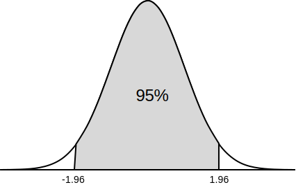

Confidence interval is a **range of values** we can be certain (with high probability) that our true value lies in.

***Example:*** Assume we have a dataset of 100 randomly chosen cricket bowlers, and their bowling speeds. Given the ***mean*** is **135 kmph** and ***standard deviation*** is **12 kmph**.

Calculate the **95% confidence interval**

The confidence interval formula is given by,

$$\bar{\mu} \pm z \cdot {\sigma \over \sqrt{n}}$$

where, z = z-score, n = no. of samples

z-score for 95% confidence is 1.96 (i.e. from -1.96 to 1.96)

$$135 \pm 1.96 \cdot {12 \over \sqrt{100}}$$

$$135 \pm 2.35$$

Therefore, the **95% confidence interval** is **132.65** to **137.35**

The table for z-score of most common confidence intervals is given below.

| Confidence | z-score |
| ---------- | ------- |
| 80%        |	1.282  |
| 85%        |	1.440  |
| 90%        |	1.645  |
| 95%        |	1.960  |
| 99%        |	2.576  |
| 99.5%      |	2.807  |
| 99.9%      |	3.291  |
