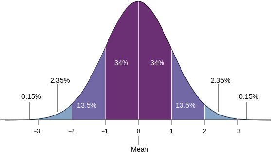
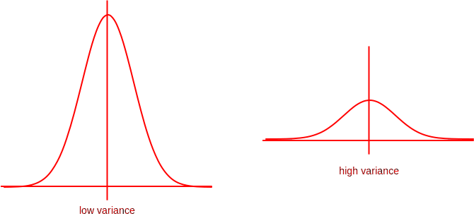
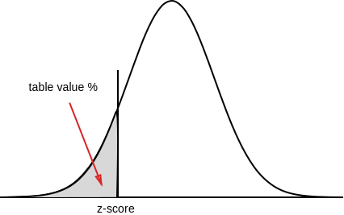
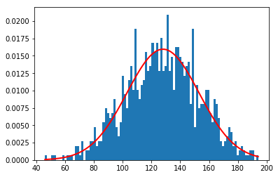

> Normal distribution is a continuous probability distribution that describes many natural datasets. It is also known as **bell curve** or **Gaussian distribution**. 



It possesses the following properties.

* The distribution is usually ***symmetric*** to the mean (μ) - half of the data will fall into left, half to the right of the mean.
* Mean, median and mode are equal
* ≈ 68% of the data falls within **1 standard deviation** of the mean
* ≈ 95% of the data falls within **2 standard deviation** of the mean
* ≈ 99.7% of the data falls within **3 standard deviation** of the mean

#### Normal distribution and variance

If the variance of the dataset is high, the curve tends to look flat. If variance is low, curve is more steeper.



### Z-scores

***Example:*** A dataset representing highest scores of cricket batsmen in One-Day International matches - given average (μ) = 128, standard deviation (σ) = 25.

If a batsman has a highest score of 103, what is the z-score?

Z-score = $${X - μ \over \sigma} = {103 - 128 \over 25} = -1$$

i.e. a highest score of 103 is **1 standard deviation below** the mean

#### Z-table

Z-table (or standard normal table) is used to map from z-scores to percentiles. For the above example, what is the percentile for a highest-score of 103 (i.e. z-score = -1) ?



Z-table is [available online](http://www.z-table.com/) or we can use `scipy.stats` package.

```python
import scipy.stats as st

z_score = st.norm.cdf(-1)
print(f'z-score of -1 = {z_score * 100:.2f} percentile')
```
```
z-score of -1 = 15.87 percentile
```

### Probability density function (PDF)

The probability density function of the normal distribution is given by,

$$f(x, \mu, \sigma) = {1 \over \sqrt{2\pi\sigma^2}} \cdot e^{-{(x - \mu)^2} \over 2\sigma^2}$$

Or in terms of z-score (z),

$$f(x, \sigma, z) = {1 \over \sqrt{2\pi\sigma^2e^{z^2}}}$$

Let's try to plot one using `matplotlib` 

> Reference: [`numpy.random.normal`](https://docs.scipy.org/doc/numpy-1.14.0/reference/generated/numpy.random.normal.html)

```python
import numpy as np
import matplotlib.pyplot as plt

mu, sigma = 128, 25 # From the above example
highest_scores = np.random.normal(mu, sigma, 1000) # Random 1000 values

count, bins, _ = plt.hist(highest_scores, 100, normed = True) # plot 100 points
plt.plot(bins, 1/(sigma * np.sqrt(2 * np.pi)) *
    np.exp( - (bins - mu)**2 / (2 * sigma**2) ),
    linewidth = 2, color = 'r') # Plot the PDF
plt.show()
```
