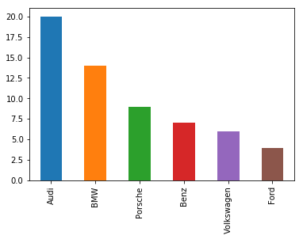

## Categorical Data

A categorical variable (also called nominal variable) use labels or names with no numerical value.

***Examples***
* Continent (Asia, Africa, Europe, Australia, North America, South America, Antarctica)
* Color (Red, Green, Cyan, Blue)
* Laptop Brand (Apple, Lenovo, Microsoft, Dell)

## Quantitative Data

Information that can be measured in numerical values which represent measurement, frequencies etc.

***Examples***
* No. of Users (50, 40, 67, 178, 207)
* Battery capacity in mAh (3100, 3200, 2800, 4000, 1500)
* Milk quantity in Litres (2.5, 1.35, 6.0, 5.4)

## Frequency Distribution

Let's take a dummy dataset - 60 Users' car brands

| Audi | Audi | BMW | Audi | Porsche | Audi | 
| Ford | Audi | Volkswagen | BMW | BMW | Audi |
| Porsche | Volkswagen | BMW | Audi | BMW | BMW 
| Audi | Porsche | Audi | Benz | BMW | Benz | 
| Volkswagen | BMW | Audi | Audi | Porsche | Porsche |
| Audi | BMW | Audi | Audi | Porsche | Benz | 
| Benz | Porsche | Audi | BMW | Volkswagen | BMW |
| Volkswagen | BMW | Audi | Audi | Porsche | Benz 
| Benz | Ford | Audi | Volkswagen | Benz | Ford |
| Ford | Audi | BMW | Audi | Porsche | BMW |

```python
import pandas as pd
import matplotlib

cars = ['Audi', 'Audi', 'BMW', 'Audi', 'Porsche', 'Audi', 
        'Ford', 'Audi', 'Volkswagen', 'BMW', 'BMW', 'Audi', 
        'Porsche', 'Volkswagen', 'BMW', 'Audi', 'BMW', 'BMW', 
        'Audi', 'Porsche', 'Audi', 'Benz', 'BMW', 'Benz', 
        'Volkswagen', 'BMW', 'Audi', 'Audi', 'Porsche', 'Porsche', 
        'Audi', 'BMW', 'Audi', 'Audi', 'Porsche', 'Benz', 
        'Benz', 'Porsche', 'Audi', 'BMW', 'Volkswagen', 'BMW', 
        'Volkswagen', 'BMW', 'Audi', 'Audi', 'Porsche', 'Benz', 
        'Benz', 'Ford', 'Audi', 'Volkswagen', 'Benz', 'Ford', 
        'Ford', 'Audi', 'BMW', 'Audi', 'Porsche', 'BMW'
]

cars_df = pd.DataFrame(cars, columns = ['brand'])
frequency_distribution = cars_df.brand.value_counts()
print(frequency_distribution)
```
```out
Audi          20
BMW           14
Porsche        9
Benz           7
Volkswagen     6
Ford           4
Name: brand, dtype: int64
```

Let's plot a **Bar chart** for the Frequency distribution
```python
frequency_distribution.plot.bar()
```


## Histograms
