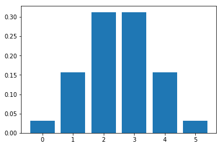
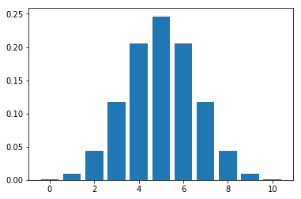
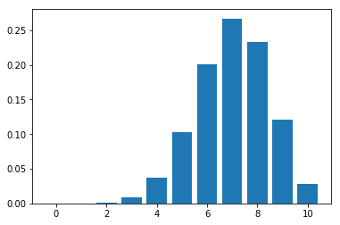
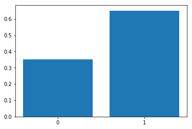

### Binomial experiment

A Binomial experiment has the following properties.

* Consists of fixed number of trials (n)
* Trials are independent of each other
* Each trial can be either success or failure
* Probability of success (P) on each trial remains the same

***Example:*** Number of heads in after flipping a coin 10 times

* The experiment is conducted for fixed number of trials - 10
* Probability of getting head in one trial does not affect the other
* Probability of getting head in any trial remains same - 0.5 (in a non-biased coin)

### Binomial variable

> A binomial variable is the number of successes (x) out of all the trials (n).

What is the probability of getting 5 heads after flipping a coin 10 times? Here $$x = 5$$ is a binomial variable.

### Binomial distribution

> The probability distribution of a binomial variable is called **Binomial distribution**.

Let's take the problem statement of flipping a coin - Probability of getting 5 heads after 10 flips? P(X = 5) can be calculated as

$$P(X = 5) = No.\,of\,outcomes\,we\,want\,\times Probability\,of\,each\,outcome$$

For 10 flips, we have a total of $$2\sup{10} =1024$$ outcomes. Hence,

$$Probability\,of\,each\,outcome={1 \over 1024}$$

No. of outcomes where exactly 5 heads occur out of 10 flips = $$^{10}C_5 = 252$$

$$P(X = 5) = 252 \times {1 \over 1024} \approx 24.6 \%$$

#### Deriving General Binomial Probability equation

Let's take the example of a biased coin instead of a fair coin with **60%** chance of heads and **40%** chance of tails.

What is the probability of getting 2 heads out of 3 tosses?

&nbsp;$$ p = 0.6$$ (Probability of getting heads)

&nbsp;$$ x = 2$$ (no. of success i.e. heads)

&nbsp;$$ n = 3$$ (no. of trials)

No. of outcomes we want = $$^{n}C_x = ^{3}C_2 = 3 $$ (HHT, HTH, THH) 

To calculate probability of each outcome, let's take one outcome- HHT

* Probability of getting **H** in trial 1 = 0.6
* Probability of getting **H** in trial 2 = 0.6
* Probability of getting **T** in trial 3 = 0.4

Hence, probability of getting HHT = $$0.6\times0.6\times0.4 = 0.144$$

i.e. $$(0.6)^2 \times (0.4)^1 = (0.6)^2 \times (1-0.6)^(2-1) = p^x \times (1-p)^{n-x}$$ 

Finally,

Probability of getting 2 heads out of 3 = $$3 \times 0.144 = 0.432$$ 

Putting it together,

$$No.\,of\,outcomes\,= ^{n}C_x$$

$$Probability\,of\,each\,outcome\,= p^x \times (1-p)^{(n-x)}$$

$$P(x\,\,of\,\,n) = ^{n}C_x\,\,p^x\,(1-p)^{(n-x)}$$

Hence, the **general binomial probability equation** is,

$$P(x\,\,of\,\,n) = {n! \over x!(n-x)!}\,p^x\,(1-p)^{(n-x)}$$

Also,

$$Expected\,Value: E[X] = n \cdot p$$

$$Variance: \sigma^2 = n \cdot p \cdot (1 - p)$$

$$Standard\,deviation: \sigma = \sqrt{n \cdot p \cdot (1 - p)}$$

### Plotting Binomial Distribution

Let $$X$$ be a random variable = No. of heads from flipping a coin 5 times

$$P(X = 0) = {5! \over 0!(5-0)!}\,0.5^0\,(1-{1 \over 2})^{(5-0)} = {1 \over 32}$$

$$P(X = 1) = {5 \over 32},$$
$$P(X = 2) = {10 \over 32},$$
$$P(X = 3) = {10 \over 32},$$
$$P(X = 4) = {5 \over 32},$$
$$P(X = 5) = {1 \over 32}$$

```python
import math
import matplotlib.pyplot as plt

def compute_binomial_probability(x, n, p):
    """Returns the probability of getting `x` success outcomes in `n` trials,
    probability of getting success being `p`

    Arguments:

    x - number of trials of the event
    n - number of trials
    p - probability of the event

    """
    outcomes = math.factorial(n) / (math.factorial(x) * math.factorial(n - x))
    probability_of_each_outcome = p ** x * (1 - p) ** (n - x)
    return outcomes * probability_of_each_outcome

def plot_binomial_distribution_graph(n, p):
    """Plots Binomial distribution graph of an event with `n` trials,
    probability of getting success of the event being `p` for values `0` to `n`

    Arguments:

    n - number of trials
    p - probability of the event

    """
    probabilities = list(map(lambda x: compute_binomial_probability(x, n, p), range(0, n+1)))
    plt.bar(list(range(0, n+1)), probabilities)

plot_binomial_distribution_graph(5, 0.5)
```



Let's plot the distribution for flipping a coin 10 times.

```python
plot_binomial_distribution_graph(10, 0.5)
```


As we can observe, with more trials, the plot tends to look like **Normal distribution**

Plotting the graph for a biased coin - $$P(head) = 0.7, P(tail) = 0.3$$

```python
plot_binomial_distribution_graph(10, 0.7)
```


## Bernoulli distribution

Bernoulli distribution is a **discrete probability distribution** of a random variable which has only two outcomes ("success" or a "failure"). It is named after Swiss mathematician [**Jacon Bernoulli**](https://en.wikipedia.org/wiki/Jacob_Bernoulli). It is a special case of Binomial distribution for n = 1.

For example, probability (**p**) of scoring a goal in last 10 minutes is **0.35** (success), probability of not scoring a goal in last 10 minutes (failure) is **1 - p = 0.65**.

Plotting Bernoulli distribution with probability for **p = 0.65**,

```
plt.bar(['0', '1'], [0.35, 0.65])
```


$$Expected\,Value: E[X] = p$$

$$Variance: \sigma^2 = p(1 - p)$$

$$Standard\,deviation: \sigma = \sqrt{p(1 - p)}$$