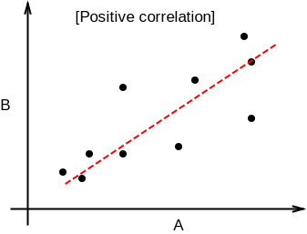
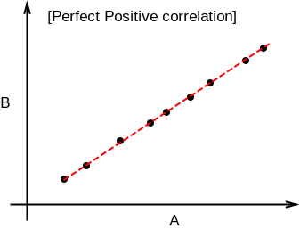

## Joint Random variables

More often, in real life, we see two or more random variables related to each other. For example, height of a person is related to weight of a person. Amount of investment is related to amount of return. Or maybe two variables are not related at all, but can occur jointly - flipping a coin and rolling a die.

For simplicity, let's take two random variables A and B.

A = flipping a coin, B = rolling a die

$$P(A \cap B) = {1 \over 12} \rightarrow Joint\,random\,variable$$

In statistics, we measure how strongly two random variables are related by two metrics - **Covariance** and **Correlation**.

## Correlation

#### Positive correlation

A positive correlation exists between two variables A and B when A increases, B also increases and B decreases when A decreases. Graph between A and B would look like the following.

***Examples***

* Height v/s Weight of a person
* Walking distance v/s calories burnt
* Product quality v/s sales

#### Perfect Positive correlation

A perfect positive correlation exists if there is a positive linear association between two variables. Which means, given variable A, we can exactly predict the value of B by multiplying with a positive number.

***Examples***

* Length of a square v/s it's circumference
* Weight in kilos v/s weight in pounds

#### Negative correlation

A negative correlation exists between two variables A and B, if A decreases when B increases and A increases when B decreases.

***Examples***

* Mobile screen time v/s remaining battery percentage
* Current run rate v/s Required run rate (in Cricket)

#### Perfect Negative correlation

A perfect negative correlation exists if there is a negative linear association between two variables.

***Examples***

* Power v/s focal length of a lens
* Frequency v/s wavelength of light

#### Zero correlation

If two variables are independent of each other, then there is no correlation or zero correlation.

***Examples***

* Bitcoin price v/s speed of light
* Your mobile usage per day v/s neighbor's electricity bill