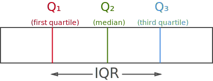

## Averaging data

Let's take an example data set of Marks of 20 students in a class out of 100.

```python
import numpy as np
grades = [60, 75, 78, 48, 89, 94, 69, 98, 91, 71,
          89, 41, 67, 94, 60, 58, 96, 83, 81, 92]
```

### Mean

#### Arithmetic Mean

> Arithmetic mean is calculated as **sum** of all numbers in the dataset and dividing by the **total** number of values

Arithmetic mean = $$\large{\mathsf{Sum\,of\,all\,numbers \over \#\,of\,values\,in\,the\,set}}$$ 

= (60 + 75 + 78 + ... + 92) / 20 = 76.7

```python
arithmetic_mean = np.mean(grades)
print(f'Arithmetic mean = {arithmetic_mean}')
```
```
Arithmetic mean = 76.7
```

#### Geometric Mean

> Geometric mean is calculated as **Nth root** of **Product** of all the numbers, where N is the total number of values in the dataset

Geometric mean = $$\mathsf{\sqrt[n]{Product\,of\,all\,numbers}}$$

= $$\sqrt[20]{60\times75\times78...\times92}$$

```python
from scipy.stats.mstats import gmean

geometric_mean = gmean(grades)
print(f'Geometric mean = {geometric_mean}')
```
```
Geometric mean = 74.69662039171091
```

### Median

> Median is the middle value, when the data is sorted in ascending order.

```python
grades_sorted = sorted(grades)
print(grades_sorted)
```
```
[41, 48, 58, 60, 60, 67, 69, 71, 75, 78, 81, 83, 89, 89, 91, 92, 94, 94, 96, 98]
                                     ^^  ^^
                                    middle numbers
Hence, Median = (78 + 81) / 2 = 79.5
```

Let's verify,
```python
grades_median = np.median(grades)
print(f'Median = {grades_median}')
```
```
Median = 79.5
```

### Mode

> Mode is the number occurring most often in the dataset

In our dataset, **89**, **94** and **60** occurs two times.

Hence, Mode = 89, 94, 60

## Measuring Variability of Data

### Interquartile range (IQR) 

> Interquartile range or IQR is the amount spread in middle 50% of the dataset ***or*** the distance between first Quartile (Q₁) and third Quartile (Q₃)

* First Quartile (Q₁) = Median of data points to ***left*** of the median in ordered list
* Second Quartile (Q₂) = Median of data
* Third Quartile (Q₃) = Median of data points to ***right*** of the median in ordered list



```
[41, 48, 58, 60, 60, 67, 69, 71, 75, 78, 81, 83, 89, 89, 91, 92, 94, 94, 96, 98]
 ^^^^^^^^^^^^^^^^^^^^^^^^^^^^^^^^^^^^^^  ^^^^^^^^^^^^^^^^^^^^^^^^^^^^^^^^^^^^^^
             first half                              second half
        median = (60 + 67) / 2 = 63.5        median = (91 + 92) / 2 = 91.5

Q₁ = 63.5
Q₃ = 91.5
IQR = Q₃ - Q₁ = 91.5 - 63.5 = 28
```

### Range

> Range is the difference between largest number and smallest number

```python
grades_range = max(grades) - min(grades)
print(f'Range = {grades_range}')
```
```
Range = 57
```

### Variance

> Variance measures how far the numbers are spread out from the mean.

* Variance, σ² = $${\sum (X - \mu)^2 \over n}$$

```python
print(f'Arithmetic mean = {arithmetic_mean}') # Mean

variance = ( sum([(x - arithmetic_mean) ** 2 for x in grades]) ) / 20
print(f'Variance = {variance}')
```
```
Arithmetic mean = 76.7
Variance = 5420.200000000001
```

### Standard Deviation

> Standard deviation is the square root of Varaince

* Standard Deviation, σ = $$\sqrt{\sum (X - \mu)^2 \over n}$$

```python
std_deviation = np.sqrt(variance)
print(f'Standard Deviation = {std_deviation}')
```
```
Standard Deviation = 16.462381358722073
```

### Z-Score

> Z-Score is a measure of how many Standard Deviations above/below the Arithmetic mean a raw score is.

* Z-Score = $${X - \bar{x} \over \sigma}$$

```python
def z_score(raw_score, mean, std_deviation):
    return (raw_score - mean) / std_deviation

z_score_60 = z_score(60, arithmetic_mean, std_deviation)
print(f'Z-score of 60 = {z_score_60}')
```
```
Z-score of 60 = -1.0144340381929031
```
