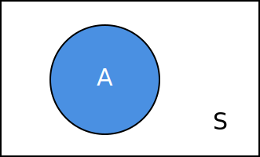
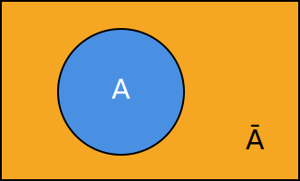
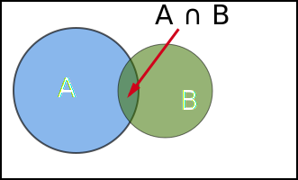
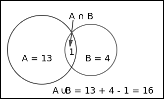

Probability = $$\large{\mathsf {\#\,of\,favorable\,outcomes \over \#\,of\,total\,possible\,outcomes}}$$

***Examples***:
* In a deck of cards (4 suites), 
    * Probability of drawing **diamond** = $${13 \over 52}$$ = $${1 \over 4}$$
    * Probability of drawing a **Jack** = $${4 \over 52}$$ = $${1 \over 13}$$

* In a 6 sided dice,
    * Probability of getting **number six** = $${1 \over 6}$$
    * Probability of getting **even number** = $${3 \over 6}$$ = $${1 \over 2}$$

## Events

Now that we know the equation for Probability, the **# of favorable outcomes** is also called an **Event** and **# of total possible outcomes** is called **Sample Space**.

$$\mathsf {\#\,of\,favorable\,outcomes\,\color{red}{\leftarrow Event\,(A,\,B,...)} \over \#\,of\,total\,possible\,outcomes\,\color{red}{\leftarrow Sample\,Space\,(S)}}$$

***Example 1***

* Sample S = Deck of cards (52)
* Event A = Drawing a **diamond** from deck of cards
* Event Ā = Complement of A = Drawing a **non-diamond** card from the deck
* P(A) = $${13 \over 52}$$ = $${1 \over 4}$$, P(Ā) = $${39 \over 52}$$ = $${3 \over 4}$$
* Also, P(A) = 1 - P(Ā)

***Example 2***
* Event B = Drawing a Jack from deck of cards
* Event (B) = Drawing a non-Jack card
* P(B) = $${4 \over 52}$$ = $${1 \over 13}$$, P(B) = $${48 \over 52}$$ = $${12 \over 13}$$

## Intersection & Union

Take the same sample space S = Deck of cards (52)

* Event A: Draw a **Diamond**
* Event B: Draw a **Jack**
* Event C: Draw a **Heart**

***Example 1: Intersection A, B***

Now, intersection of Event A &amp; Event B (or A and B) refers to **Drawing a Diamond Jack** card. There is only 1 card satisfying this condition.

* A ∩ B =&gt; intersection of A and B =&gt; A and B
* P(A ∩ B) = $${1 \over 52}$$

***Example 2: Union A, B***

Union of Event A &amp; Event B (A or B) refers to **Drawing a Diamond card or a Jack card**. There are 13 Diamond cards and 4 Jack cards.

* A ∪ B =&gt; Union of A and B =&gt; A or B
* P(A ∪ B) = $${16 \over 52}$$

Looking at graphically,

* P(A ∪ B) = P(A) + P(B) - P(A ∩ B)

***Example 3: Intersection A, C***

Intersection of Event A &amp; Event C refers to **Drawing a card which is both Diamond and Heart**. There are no cards with such condition.

* A ∩ C = Ø
* Event A and Event C are **Mutually exclusive**

